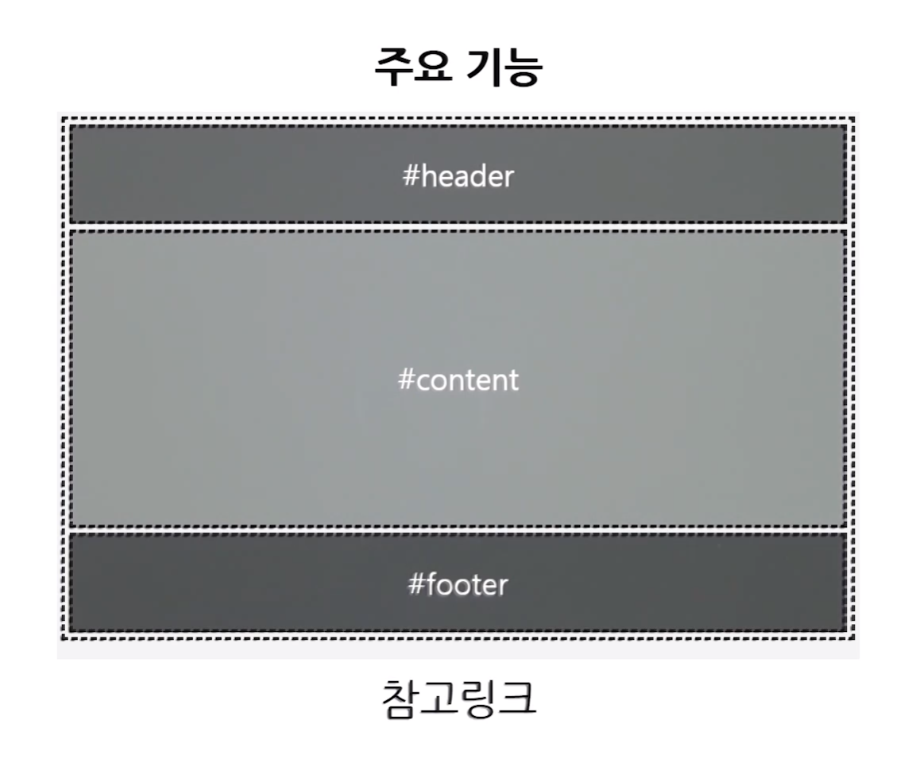

# 레이아웃 소개
레이아웃 제작은 모든 웹사이트를 만드는 과정에서 가장 먼저 선행되어 하는 작업

웹 페이지의 레이아웃이란?
- 레이아웃은 책이나 신문, 잡지 등의 출판물에서 글이나 그림을 효과적으로 정리하고 배치하는 일을 뜻하는 출판용어
- 이와같이 웹사이트를 제작할때 메뉴, 컨텐츠 부가정보 등과 같은 구성요소들을 필요한 곳에 위치하여 사용자가 효과적으로 웹사이트를 이용할 수 있게 배치하는 작업을 말함

레이아웃(그리드 레이아웃)의 종류
- 1단 레이아웃
- 다단(2, 3단....) 레이아웃
- 고정(상, 하단 고정) 레이아웃
- 그 외의 다양한 레이아웃

## 1단 레이아웃 제작

- 1단 레이아웃은 위의 이미지와 같이 하나의 행으로 이루어진 레이아웃의 형태를 말한다.
- 이런 형태의 레이아웃은 웹에서 가장 기본이 되는 레이아웃이며 위의 이미지 처럼 상단(header), 중단(contents), 하단(footer)의 구성으로 이루어져있는 것이 가장 일반적


1단 형태를 가진 사이트
- (네이버 쇼핑) shopping.naver.com/home/p/index.nhn 
- (네이버 사전) dict.naver.com  
- (네이버 포스트) post.naver.com/navigator.nhn  


작업 전 참고 사항
- 주요 기능 
  - 1개의 행(column)을 갖는 레이아웃
  - 요소로 header, content, footer를 가짐
- 스타일 정보
  - 컨텐츠 최대 가로 길이: 1200
  - 사이트 최소 가로 길이: 800
  - 컨텐츠 가운데 정렬
- 주요 태그 및 속성 
 - HTML
  - div
  - header
  - section
  - footer
- CSS
  - max-width
  - min-width
  - margin

```html
<!DOCTYPE html>
<html lang="ko">
  <head>
    <meta charset="utf-8">
    <title>1단 레이아웃</title>
    <style>
      .wrap {
        /* 최소 가로길이 */
        min-width: 800px;
        text-align: center;
      }
      .header {
        height: 100px;
        background-color: lightgreen;
      }
      .content {
        /* 최대 가로 길이 */
        max-width: 1200px;
        height: 300px;
        /* 블럭요소 가운데 정렬 */
        margin: 0 auto;
        background-color: lightsalmon;
      }
      .footer {
        height: 100px;
        background-color: lightblue;
      }
    </style>
  </head>
  <body>
    <div class="wrap">
      <div class="header">HEADER</div>
      <div class="content">CONTENT</div>
      <div class="footer">FOOTER</div>
    </div>
  </body>
</html>
```
- 레이아웃에 필요한 요소들(header, section, footer 등)을 `<body>`태그 안에 바로 작성하는 것 보다는 레이아웃과 관련된 아이템들을 감쌀 수 있는 wrap(또는 wrapper) 클래스를 가진 div를 만들어 레이아웃 컨테이너의 역할을 할 수 있도록 함
  - 권장을 하는것이지 무조건은 아님